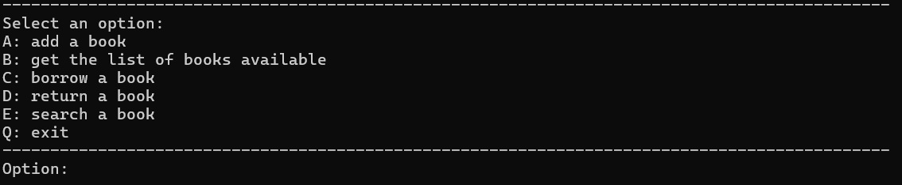
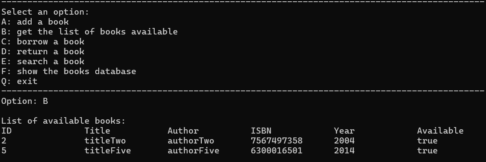
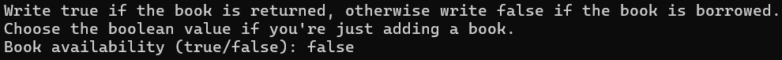
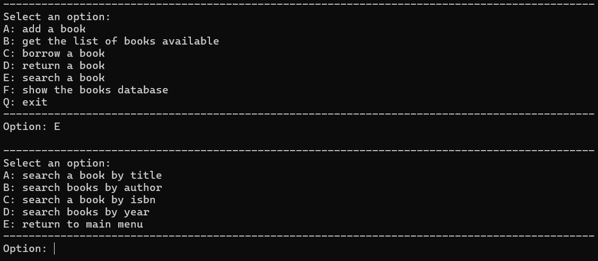
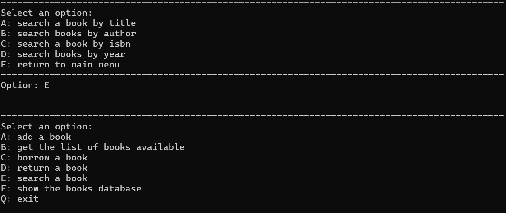

# Mini Library Management System


## Project Description
### What it does ?
This library management system allows you to add a book, to display the list of available books, to manage books that are borrowed/returned, to see the library books database, and finally, to search a book by its title, author, ISBN and year.

<br>
<br>

### Technologies I used
For this project, I decide to write the code in Java because I wanted to learn the basic knowledge of Object Oriented Programming. This project helped me practice:

* classes/objects
* classes methods and attributes
* constructors
* modifiers
* encapsulation. 

I also learned about the ArrayList data structure. 
<br>
For the IDE, I used Visual Studio Code.

<br>
<br>

### Description
This project contains two classes: `Book` class and `Library` class.
<br>
- The `Book` class is used to create attributes (features) and methods (actions) that will define an object of this class. It will be used in the `Library` class where the books database will be created. <br>
It has 6 attributes: `id`, `title`, `author`, `isbn`, `year`, `availability`. They represent the features of a Book object. The types of these attributes are respectively `int` (integer), `String` (text), `String` (text), `String` (text), `int` (integer) and `boolean` (true/false). <br>
I separated this class into three categories of methods: getters/setters, displays and other methods. The getters and setters are methods that will enable to get the value of these attributes (getters) and set the value of these attributes (setters). The purpose of the displays and inputs methods are to manage the display output. The other methods I created are `isBookAvailabilityMatches(Book book)` which has for purpose to check if the availability of the current book is the same as the availability of the book passed as parameter, and `equals(Book book)` which has for purpose to check if two books (the current one and the one passed as parameter) are equals.

``` java
public class Book {
    // attributes
    private int id;
    private String title;
    private String author;
    private String isbn;
    private int year;
    private boolean availability;

    // constructor
    public Book(int bookID, String bookTitle, String bookAuthor, String bookIsbn, int bookYear, boolean bookAvailability) {
        this.id = bookID;
        this.title = bookTitle;
        this.author = bookAuthor;
        this.isbn = bookIsbn;
        this.year = bookYear;
        this.availability = bookAvailability;
    }


    /* ======================================================= GETTERS AND SETTERS ======================================================= */
    /* =================================================================================================================================== */
    // methods....

    /* ======================================================= DISPLAYS METHODS ========================================================== */
    /* =================================================================================================================================== */
    // methods....
}
```

- The `Library` class is the main script of the program. <br>
Here the only attribute created is the one that will connect the database to the library. <br>
This class also regroups the main actions that we can do on this library management system. For exemple, we can find the following methods: 
    - `addBook(Book book)` : to add a book
    - `getBooksAvailable()` : to get the list of available books
    - `borrowBook(Book book)` : to borrow a book
    - `returnBook(Book book)` : to return a book
    - `searchBooks(Scanner input)` : to search a book
    - `printBooksDatabase()` : to display the books database


<br>
<br>
<br>

## How to run the project ?
Run the project via command line: <br>
Compile `Book` class and `Library` class by writing: <br>
```
C:\path\to\the\project> javac Book.java
C:\path\to\the\project> javac -cp ../ Library.java
```

Then write: <br>
```
C:\path\to\the\project> java -cp ../ library_management/Library.java
```

You should have this output: <br>


<br>
<br>
<br>

## How to use the project ?
### Add a book to the library
To **add a book**, you must enter the letter **A** at the option input. Then you have to enter the information of the book you wanna add. Be careful of the type of data you enter ! (refer to [this section](#description) for more information). After you have entered the book's information, you should have a message saying "*Book added !*".
If you have entered a book that is already in the database, the message displayed on the output is "*The book is already in the database !*". <br>
If you want to check if the book is really added, when the menu shows again enter the letter **F**.

<br>
<br>

### Get the list of available books
To **get the list of available books**, you must enter the letter **B** at the option input. You should have this output (depending of how many books available there is):


<br>
<br>

### Manage borrowed books
> In this project, the value **true** for the availability of the book means that it is available (it can be borrowed). <br>
> On the contrary, the value **false** means that the book is not available (it can not be borrowed).  

To say that a book is borrowed, we set the availability of the book to false. Caution, this information must be true before this action ! To update the book availability to false, you must enter the letter **C** at the option input and then all its information (id, title, ...). When doing that, there is a mini explanation to set the boolean value depending what action you wanna do. <br>
 <br>
If you want to check if the book is really borrowed, when the menu shows again enter the letter **F**.

<br>
<br>

### Manage returned books
> In this project, the value **true** for the availability of the book means that was already available before its return (it can not be returned). <br>
> On the contrary, the value **false** means that the book was not available before its return (it can be returned). 

To say that a book is returned, we set the availability of the book to true. Caution, this information must be false before this action ! To update the book availability to true, you must enter the letter **D** at the option input and then all its information (id, title, ...). Again, when doing that there is a mini explanation to set the boolean value depending what action you wanna do. 

<br>
<br>

### Search a book (by title, author, ...)
> As I said in the project description, we can search a book by its title or its author or its ISBN or its year.

First, you must enter the letter **E** to access the menu to select by which information of the book we wanna do the research. You should have this output after entering the letter:


* Option **A** -> search a book by its **title**:
    - After entering the letter A at the option input, you must write the title of the book you wanna search. If it is found, the output shows the book with all its information, otherwise a message saying "*There is no book(s) corresponding to that title.*" is displayed.
* Option **B** -> search a book by its **author**:
    - After entering the letter B at the option input, you must write the author of the book (or books) you wanna search. If it is found, the output shows the book with all its information, otherwise a message saying "*There is no book(s) corresponding to that author.*" is displayed.
* Option **C** -> search a book by its **ISBN**:
    - After entering the letter C at the option input, you must write the ISBN of the book you wanna search. If it is found, the output shows the book with all its information, otherwise a message saying "*There is no book(s) corresponding to that isbn.*" is displayed.
* Option **D** -> search a book by its **year**:
    - After entering the letter D at the option input, you must write the year of the book (or books) you wanna search. If it is found, the output shows the book with all its information, otherwise a message saying "*There is no book(s) corresponding to that year.*" is displayed.
* Option **E** -> return to the main menu:
    - After entering the letter E at the option input, you redirected to the main menu:
    

<br>
<br>

### Exit the library
Finally, to **exit** from this project, you must enter the letter **Q**. Note that if you are in the search book menu, you must enter option E then enter option Q.

<br>
<br>
<br>

## Credit - Author
- Author/Credit: [vchrstn]()
